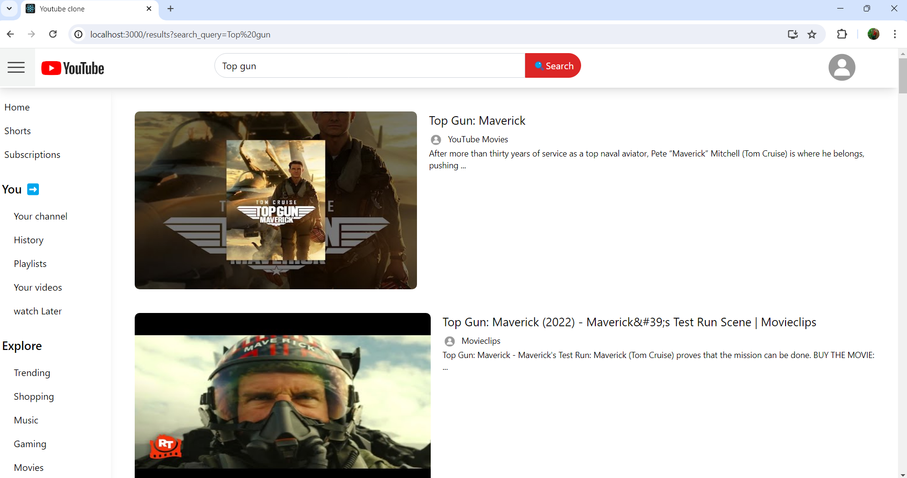

# YouTube Clone

YouTube Clone is a responsive web application that mimics the core functionalities of YouTube. Developed using React, Redux, and Tailwind CSS, it offers features like searching, showing suggestions while searching, debouncing, LRU cache, and API polling to provide a seamless and efficient user experience.

## Table of Contents
- [Features](#features)
- [Technologies Used](#technologies-used)
- [Getting Started](#getting-started)
- [Installation](#installation)
- [Environment Variables](#environment-variables)
- [Screenshots](#screenshots)


## Features

- **Responsive Design**: Adaptable to various screen sizes for a seamless user experience on both desktop and mobile devices.
- **Searching**: Implements search functionality to find videos based on user queries.
- **Search Suggestions**: Provides real-time search suggestions as the user types.
- **Debouncing**: Optimizes search input to minimize API calls and improve performance.
- **LRU Cache**: Implements a Least Recently Used cache mechanism to store and retrieve frequently accessed data efficiently.
- **API Polling**: Continuously updates data by polling APIs at regular intervals.
- **Modern Styling**: Utilizes Tailwind CSS for a modern and customizable UI.

## Technologies Used

- **React**: Frontend library for building user interfaces.
- **Redux**: State management library.
- **Tailwind CSS**: Utility-first CSS framework.
- **Axios**: Promise-based HTTP client for making API requests.
- **LRU Cache**: Least Recently Used cache implementation.
- **Debounce Function**: Optimizes performance by limiting the rate at which a function can fire.

## Getting Started

To get a local copy up and running follow these simple steps.

### Prerequisites

- Node.js and npm installed

### Installation

1. Clone the repository:
   ```bash
   git clone https://github.com/yourusername/youtube-clone.git
   cd youtube-clone

### Environmental Variables
- create a .env at root level and add
- REACT_APP_GOOGLE_API_KEY=your-youtube-api-key


### Screenshots

## Homepage


## Search Suggestions


## Search Results



## watch video


